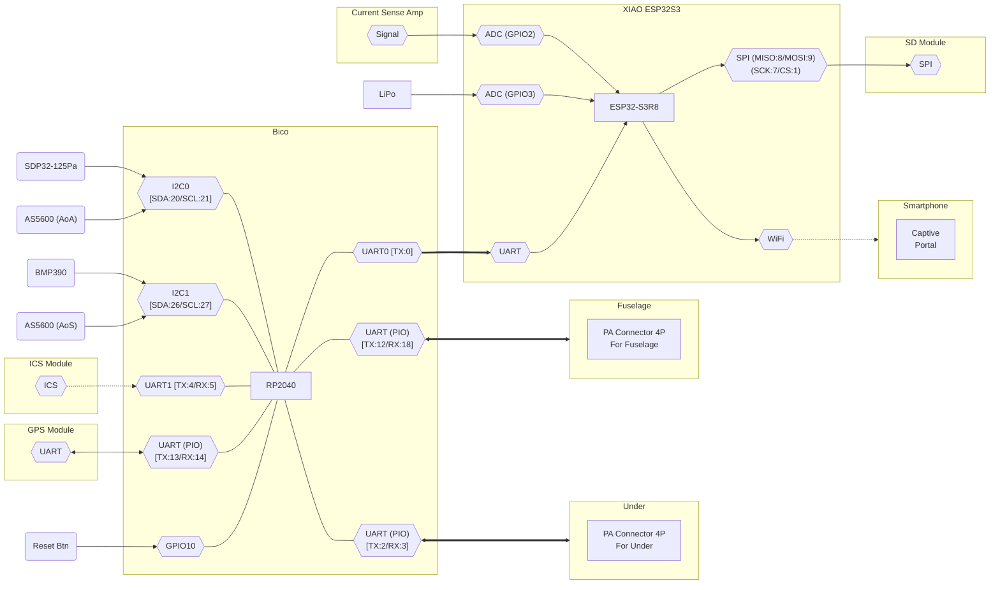
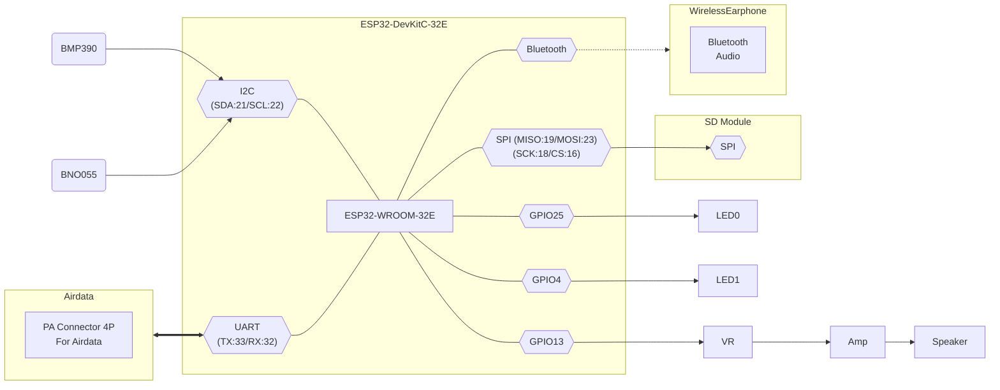

# 鳥コン2026電装 - 構成図

## エアデータ(Airdata)

```mermaid
flowchart LR
    SDP(SDP32-125Pa)
    AOA("AS5600 (AoA)")
    BMP(BMP390)
    AOS("AS5600 (AoS)")
    RESET_BTN("Reset Btn")

    subgraph "Bico"
        CPU[RP2040]
        I2C0{{"I2C0
        [SDA:20/SCL:21]"}}
        I2C1{{"I2C1
        [SDA:26/SCL:27]"}}
        UART1{{"UART0 [TX:0]"}}
        UART0{{"UART1 [TX:4/RX:5]"}}
        PIO0{{"UART (PIO)
        [TX:2/RX:3]"}}
        PIO1{{"UART (PIO)
        [TX:12/RX:18]"}}
        PIO2{{"UART (PIO)
        [TX:13/RX:14]"}}
        RESET{{GPIO10}}

        I2C0 --- CPU
        I2C1 --- CPU
        UART0 --- CPU
        PIO2 --- CPU
        RESET --- CPU
        CPU --- UART1
        CPU --- PIO0
        CPU --- PIO1
    end

    subgraph ICS Module
        ICS{{ICS}}
    end

    subgraph GPS Module
        GPS{{UART}}
    end

    subgraph Under
        PA0["PA Connector 4P
        For Under"]
    end

    subgraph Fuselage
        PA1["PA Connector 4P
        For Fuselage"]
    end

    subgraph Smartphone
        CAP["Captive
        Portal"]
    end

    SDP --> I2C0
    AOA --> I2C0
    BMP --> I2C1
    AOS --> I2C1
    ICS -.-> UART0
    RESET_BTN --> RESET
    UART1 ==> UART_ESP
    PIO0 <===> Under
    PIO1 <===> Fuselage
    GPS <--> PIO2

    subgraph XIAO ESP32S3
        CPU1[ESP32-S3R8]
        ADC0{{"ADC (GPIO2)"}}
        ADC1{{"ADC (GPIO3)"}}
        UART_ESP{{UART}}
        SPI_XIAO{{"SPI (MISO:8/MOSI:9)
        (SCK:7/CS:1)"}}
        WiFi{{"WiFi"}}
    end

    subgraph SD Module
        SD{{"SPI"}}
    end

    subgraph Current Sense Amp
        AMP_SIG{{"Signal"}}
    end

    AMP_SIG --> ADC0
    LiPo --> ADC1
    ADC0 --> CPU1
    ADC1 --> CPU1
    UART_ESP --> CPU1
    CPU1 --> SPI_XIAO
    CPU1 --> WiFi
    SPI_XIAO --> SD
    WiFi -.-> Smartphone
```

# 胴体桁(Fuselage)

```mermaid
flowchart LR
    BMP(BMP390)
    BNO(BNO055)


    subgraph Airdata
        PA1["PA Connector 4P
        For Airdata"]
    end

    subgraph ESP32-DevKitC-32E
        CPU[ESP32-WROOM-32E]
        UART{{"UART
        (TX:33/RX:32)"}}
        SPI{{"SPI (MISO:19/MOSI:23)
        (SCK:18/CS:16)"}}
        I2C{{"I2C
        (SDA:21/SCL:22)"}}
        SPK{{GPIO13}}
        LED_PIN0{{GPIO25}}
        LED_PIN1{{GPIO4}}
        BR{{Bluetooth}}
    end

    subgraph SD Module
        SD{{"SPI"}}
    end

    subgraph WirelessEarphone
        A2DP[Bluetooth
        Audio]
    end

    Airdata <==> UART
    BMP --> I2C
    BNO --> I2C
    I2C --- CPU
    UART --- CPU
    CPU --- LED_PIN0
    CPU --- LED_PIN1
    CPU --- SPK
    CPU --- SPI
    CPU --- BR
    SPI --> SD
    SPK --> VR --> Amp --> Speaker
    LED_PIN0 --> LED0
    LED_PIN1 --> LED1
    BR -.-> WirelessEarphone
```
