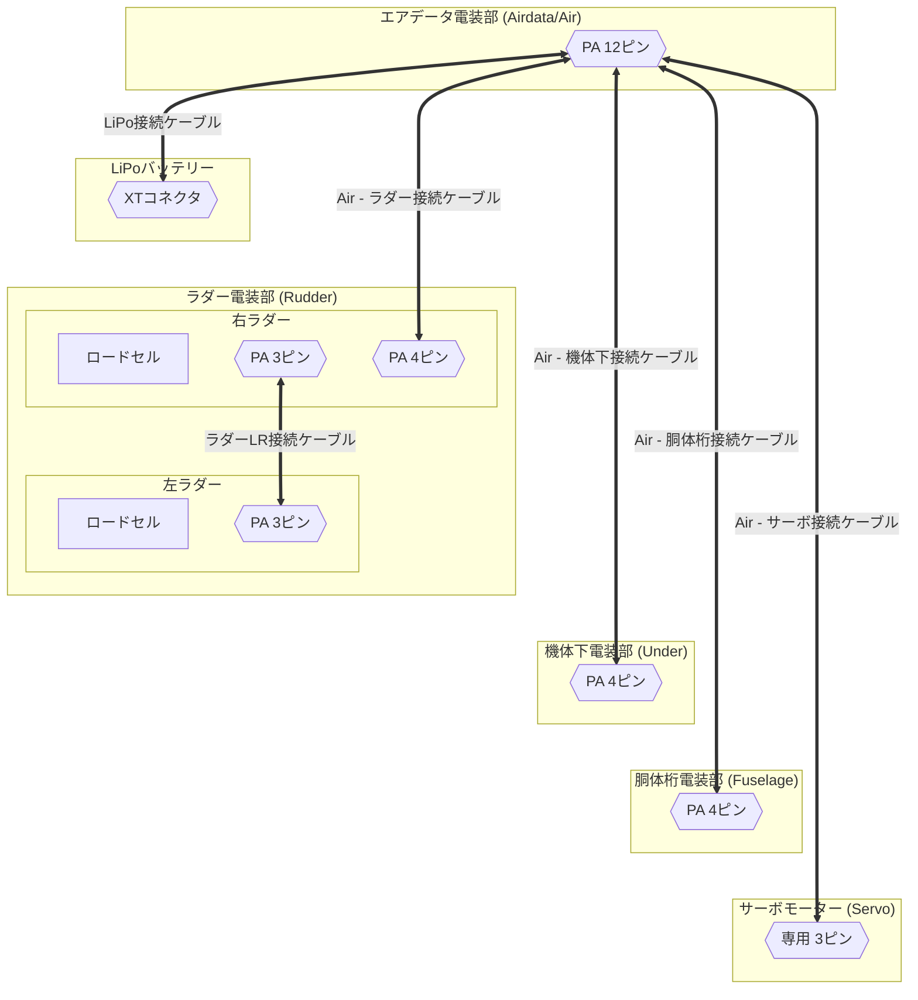
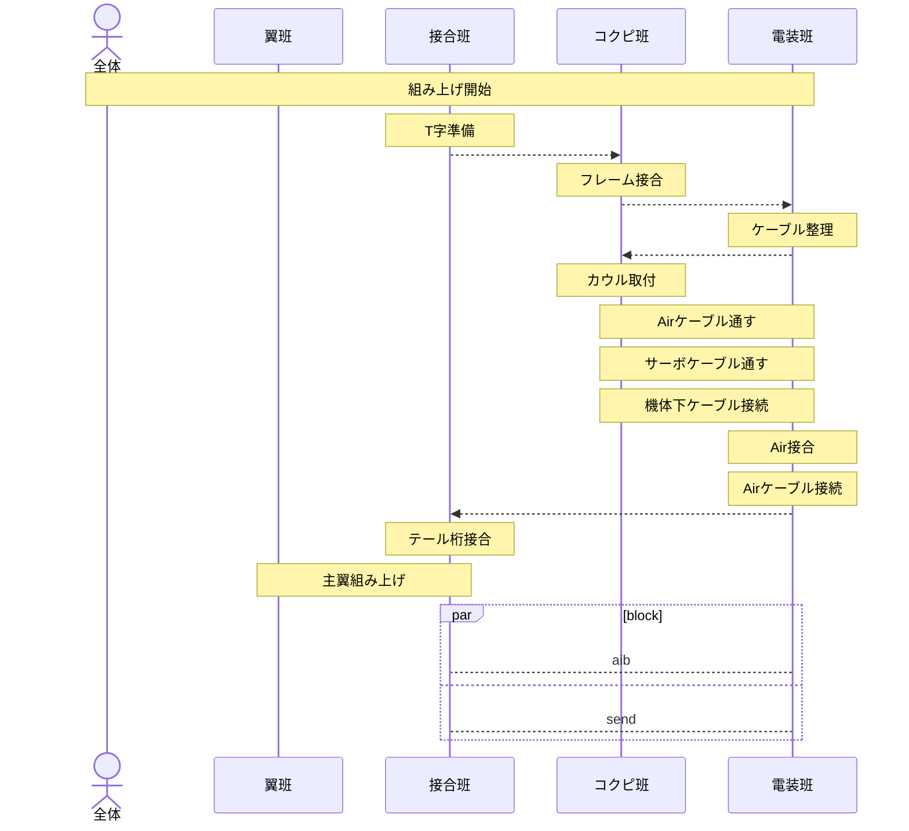

# [20260622] 2026 REWRITE搭載電装 - 取り扱い説明書

## ⚠️注意事項⚠️
- 発煙・発火などの異常が見られた場合，速やかに電源を遮断すること．
- LiPoバッテリーに膨張などの異常が見られた場合，使用しないこと．
- 電源を投入する際，サーボモーターが急激に駆動することを周知する声掛けをすること．
- ***異常と判断できなくても，気になることがあればすぐに26代の電装班員に報告・確認すること．***
    - 異常を見つけてくれたらヒーロー🦸
    - 異常じゃなければ一安心🥰

## ケーブルの接続

## アセンブリ - シーケンス図
