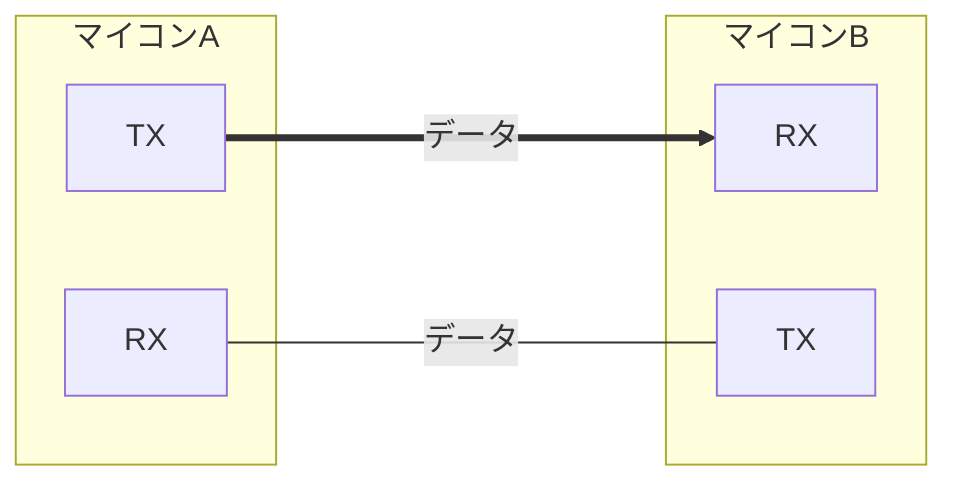

# 鳥コン2026出場滑空機"REWRITE"の電装

```mermaid
flowchart LR
    subgraph MCU_A ["マイコンA"]
        direction TB
        TX_A["TX"]
        RX_A["RX"]
    end

    subgraph MCU_B ["マイコンB"]
        direction TB
        RX_B["RX"]
        TX_B["TX"]
    end

    %% TXとRXをクロスして接続します
    TX_A ====>|"データ"| RX_B
    RX_A <====|"データ"| TX_B
    
```
