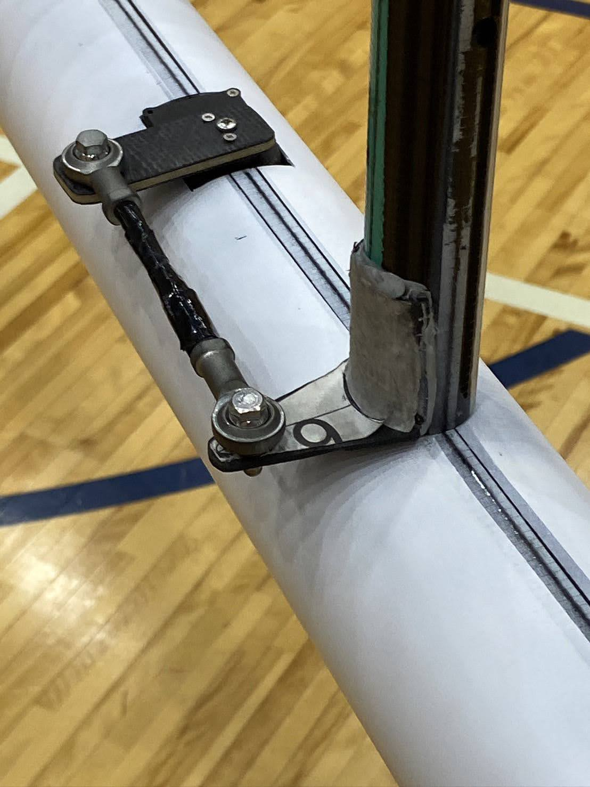
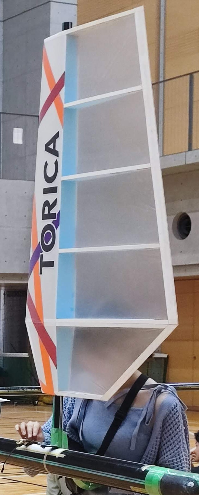
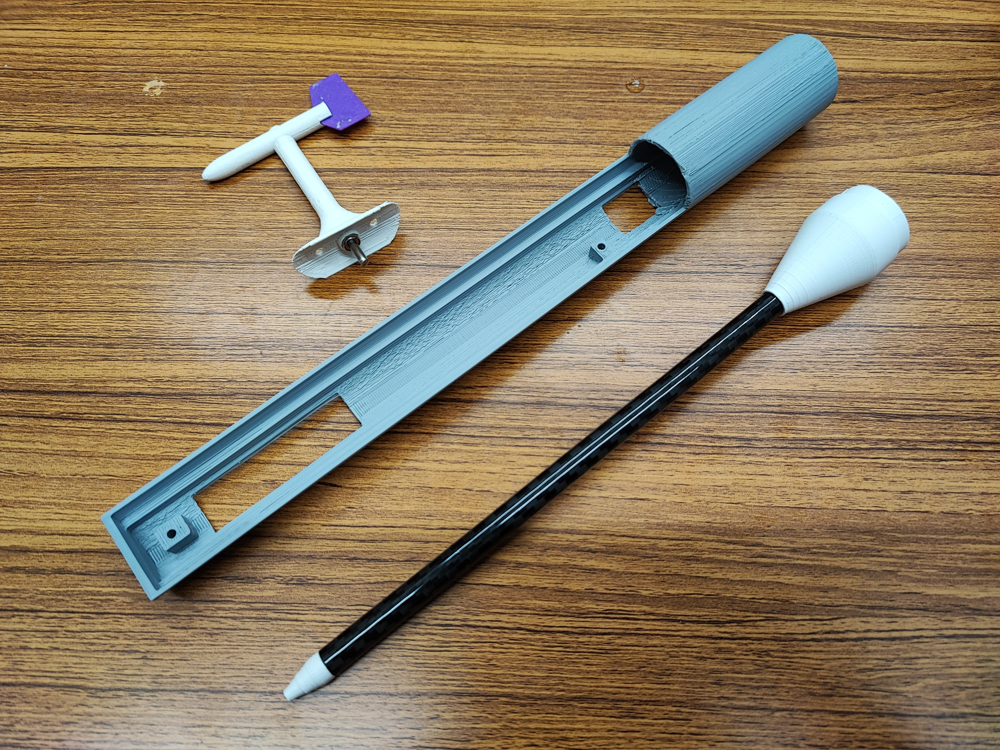
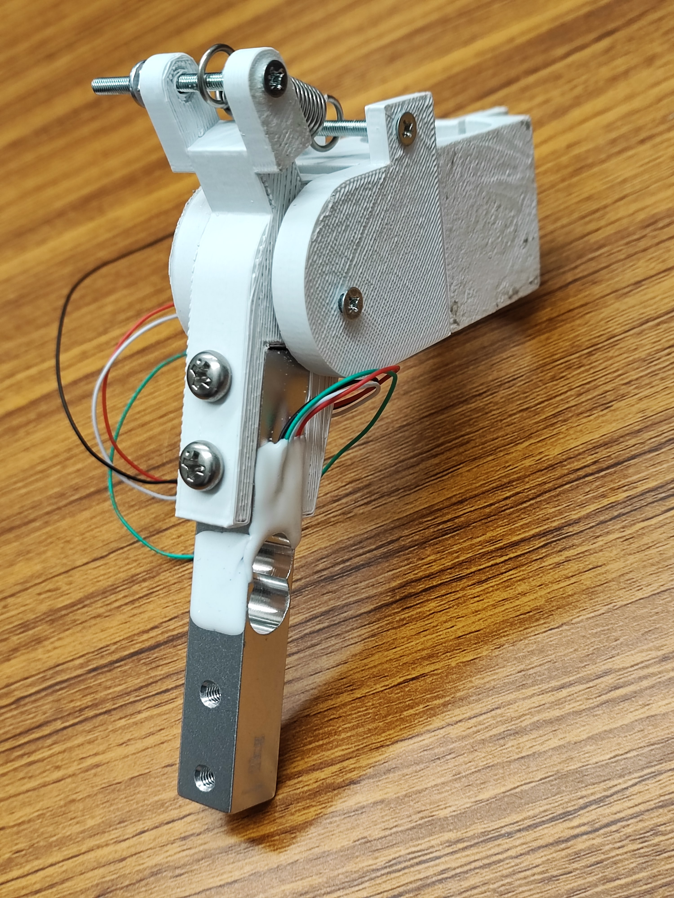

---

 
<h1 align="center">一般教養としての電装</h1>

26代電装班長　<a href="https://git.meganekinoko.com">00kenno</a>

2026/05/22 全体MTG

 

---

 
 
 

---

 
<h1 align="center">この資料の意義✒️</h1>

 電装班はかなりマニアックなため理解者が少ないですが，触れる機会はかなりあります！ 
 ➔ <em><strong>電装への無知がそのままリスクに！</strong></em>⚠️

 

 この資料には，（関わりのない人にも）<em><strong>一般教養として知っていてほしいこと</strong></em> をまとめました．

 

---

 
 
 

---

<h1>使っている道具 - 1</h1>
<table>
 <tr>
   <td></td>
   <td>
    
     <h2>はんだごて</h2>
     
⚠️やけどに注意🌡️

   </td>
 </tr>
</table>
<ul>
 <li>300℃を超える高温になります🌡️</li>
 <li>なかなか冷めません⚠️</li>
 <li>「はんだ付け」に使います🔧</li>
 <li>はんだ以外を溶かさないでください🚫</li>
</ul>

 
 
 

<h3>❓️はんだ付けとは❓️</h3>

 「はんだ」と呼ばれる低い温度で融ける合金で金属同士を継ぎ合わせることです．
  
 導電性が良いので，<em><strong>電子回路の製作</strong></em> に用いられます．
  
 <em><strong>基板に対する部品の取り付け</strong></em> や，<em><strong>ケーブルの製作</strong></em> で行います．

<table>
 <tr>
  <td></td>
  <td></td>
 </tr>
</table>

 
 
 

<h3>⚠️持ち方に注意⚠️</h3>
<table>
  <tr>
    <th>✅️正しい</th>
    <th>❌️間違い</th>
  </tr>
  <tr>
    <td></td>
    <td></td>
  </tr>
</table>

 
 
 

<h3>🌡️熱くなる場所🌡️</h3>
   <ul>
    <li>はんだごての<em><strong>金属部分全て</strong></em></li>
    <li>はんだごてを置く<em><strong>こて台</strong></em></li>
   </ul>
<table>
 <tr>
  <td></td>
  <td>
    
   <h2>こて台</h2>
  </td>
 </tr>
</table>
 

    当然見た目にはわからないので注意⚠️ 
    熱いことを<em><strong>常に疑ってください！</strong></em>🌡️

 
 
 

 
<h3>⚠️注意事項⚠️</h3>

はんだごてについて，<em><strong>以下のことを忘れないでください！</strong></em>

<ul>
 <li>使っている人の周りを<em><strong>むやみに動き回らない</strong></em>🚫</li> 
 <li>使うときは<em><strong>「高温であること」を周知する</strong></em>🔔</li>
 <li>使わないときは<em><strong>必ずコンセントから抜く</strong></em>🔌</li>
</ul>
 

---

 
 
 

---

<h1>使っている道具 - 2</h1>
<table>
 <tr>
   <td></td>
   <td>
    
     <h2>ホットプレート</h2>
     
⚠️やけどに注意🌡️

   </td>
 </tr>
</table>
<ul>
<li>300℃弱の高温になります🌡️</li>
<li>なかなか冷めません⚠️</li>
<li>「表面実装」に使います🔧</li>
<li>食べ物には使用しないでください🚫</li>
</ul>

 
 
 

<h3>❓️表面実装とは❓️</h3>

 予めクリームはんだを塗った<em><strong>基板自体を加熱し</strong></em>
  
 <em><strong>最小1mm以下の小さな部品</strong></em> を<em><strong>一度に</strong></em> はんだ付けする技術です．

<table>
 <tr>
  <th>1mm x 0.5mmのチップ抵抗</th>
  <th>SOPのICチップ</th>
 </tr>
 <tr>
  <td></td>
  <td></td>
 </tr>
</table>

 
 
 

 
<h3>⚠️注意事項⚠️</h3>

ホットプレートについて，<em><strong>以下のことを忘れないでください！</strong></em>

<ul>
 <li>リフロー作業中に<em><strong>振動を与えない</strong></em>🚫（非常に小さな部品を扱うため）</li>
 <li>使うときは<em><strong>「高温であること」を周知する</strong></em></li>
</ul>
 

---

 
 
 

---

<h1>使っている道具 - 3</h1>
<h2>ニッパー</h2>
<ul>
 <li>電線を切断できます✂</li>
</ul>
<table>
 <tr>
   <td></td>
   <td></td>
 </tr>
</table>

---

 
 
 

---

<h1>使っている道具 - 4</h1>
<h2>ラジオペンチ</h2>
<ul>
 <li>六角ナットを回すなど，強く掴む用途に向きます💪</li>
 <li>狭い場所でも使えます✅️</li>
 <li>曲げる，切るなど多機能です✨️</li>
</ul>
<table>
 <tr>
   <td></td>
   <td></td>
 </tr>
</table>

---

 
 
 

---

<h1>使っている道具 - 5</h1>
<h2>ワイヤーストリッパー</h2>
<ul>
 <li>電線のビニールを楽に剥がせます✨️</li>
</ul>
<table>
 <tr>
   <td></td>
   <td></td>
 </tr>
</table>

---

 
 
 

---

<h1>使っている道具 - 6</h1>
<h2>3Dプリンター</h2>
<ul>
 <li>3次元立体形状を生成します✨️</li>
 <li>材料は<em><strong>フィラメント</strong></em> です⭕️</li>
</ul>
<table>
 <tr>
  <th>3Dプリンター</th>
  <th>フィラメント</th>
 </tr>
 <tr>
   <td></td>
   <td></td>
 </tr>
</table>

 フィラメントは非常に湿気を吸いやすいです！（印刷品質が低下します⚠️） 
 <em><strong>同じ部屋で湿度が上がるようなことをしないでください！</strong></em>

---

 
 
 

---

<h1>使っている部品 - 1</h1>
<h2>様々なセンサ</h2>

正確なデータが取得できるように，<em><strong>高度なセンサ</strong></em> を使用しています．

<ul>
 <li>非常に高価なものがあります💰️</li>
 <li>壊れやすいので，基本的に触れないでください🚫</li>
</ul>
<table>
 <tr>
  <th>差圧センサ(約¥6000)</th>
  <th>超音波センサ(約¥3000)</th>
 </tr>
 <tr>
   <td></td>
   <td></td>
 </tr>
</table>

---

 
 
 

---

<h1>使っている部品 - 2</h1>
<h2>LiPoバッテリー</h2>

 ハイパワーなサーボモーターを駆動するために，高電圧・大電流が供給可能かつ小型・軽量な 
 <em><strong>リチウムポリマー(Li-Po)バッテリー</strong></em> を採用しています．

<ul>
 <li>落下・ショート(短絡)は厳禁です🚫(やってしまったら報告)</li>
 <li>エネルギー密度が高いため，破損すると発火・炎上します🔥</li>
</ul>
<table>
 <th>LiPoバッテリー</th>
 <th>防爆バッグ</th>
 <tr>
   <td></td>
   <td></td>
 </tr>
</table>

 
 
 

<h3>⚠️衝撃に注意⚠️</h3>

<em><strong>
 膨張したバッテリーを使用してはいけません！🚫
  
 発見したらすぐに教えてください！🔔
</strong></em>

<table align="center">
  <tr>
    <th>刺突🔪</th>
    <th>充電中の炎上🔥</th>
  </tr>
  <tr>
    <td></td>
    <td></td>
  </tr>
</table>

発火してしまったら？ ➔ <em><strong>大量の水または消火器</strong></em> で消火します🧯

---

 
 
 

---

<h1>使っている部品 - 3</h1>
<table>
 <tr>
   <td></td>
   <td>
    
     <h2>サーボモーター</h2>
   </td>
 </tr>
</table>
<ul>
 <li>高価です💰️</li>
 <li>強力に垂直尾翼を駆動します⚙️</li>
</ul>

 
 
 

<h3>⚠️急な動作・逆起電力に注意⚠️</h3>
<ul>
 <li>動作中は翼に当たらないように離れてください✋️</li>
 <li>とても強力なので，指を挟んだりしないでください⚠️</li>
 <li>無理やり動かすと，逆起電力により破壊する可能性があります⚡️</li>
</ul>
<table>
 <th>平行リンク機構</th>
 <th>垂直尾翼</th>
 <tr>
  <td></td>
  <td></td>
 </tr>
</table>

---

 
 
 

---

<h1>ケーブルの取り扱い</h1>
<h2><em><strong>必ずコネクターを持って</strong></em> 抜き差ししてください！</h2>

 断線してしまう可能性があります⚠️ 
 コネクターには<em><strong>ロック機構</strong></em> がある場合があります🔒️ 
 抜けにくい場合でも，慎重に力を入れてください✅️

<table>
 <tr>
  <th>コンセントの抜き差し</th>
  <th>PAコネクタ</th>
 </tr>
 <tr>
   <td></td>
   <td></td>
 </tr>
</table>

---

 
 
 

---

<h1>電装班の製作物について</h1>
<h2>オリジナル基板など</h2>

 <em><strong>非常にデリケート</strong></em> です⚠️
  
 <em><strong>手の油分で動作しなくなる</strong></em> こともあります！

<ul>
 <li>基本的に，製作者以外触れないでください🚫</li>
 <li>基板を持つときは端を持ってください✅️</li>
 <li>基板上の部品には触らないでください🚫</li>
</ul>
<table>
 <tr>
  <th>試作基板組立</th>
  <th>試作基板部品</th>
 </tr>
 <tr>
   <td></td>
   <td></td>
 </tr>
</table>

 
 
 

<h2>3Dプリンター製部品など</h2>

 <em><strong>破損しやすいものがあります</strong></em>⚠️ 

<ul>
 <li>丁寧に取り扱ってください✅️</li>
 <li>作った人も机の上に放置しないでください🚫</li>
</ul>
<table>
 <tr>
  <th>ピトー管など</th>
  <th>ラダー</th>
 </tr>
 <tr>
   <td></td>
   <td></td>
 </tr>
</table>

---

 
 
 

---

 
<h1 align="center">最後に✒️</h1>

 <em><strong>最後までお付き合いいただきありがとう！</strong></em> 
 少しでも電装を理解してくれたなら嬉しいです☺️

<h2 align="center">
 安全な鳥科ライフを！✈
</h2>
 

---

[Home](https://torica-org.github.io/electronics-blog/)
