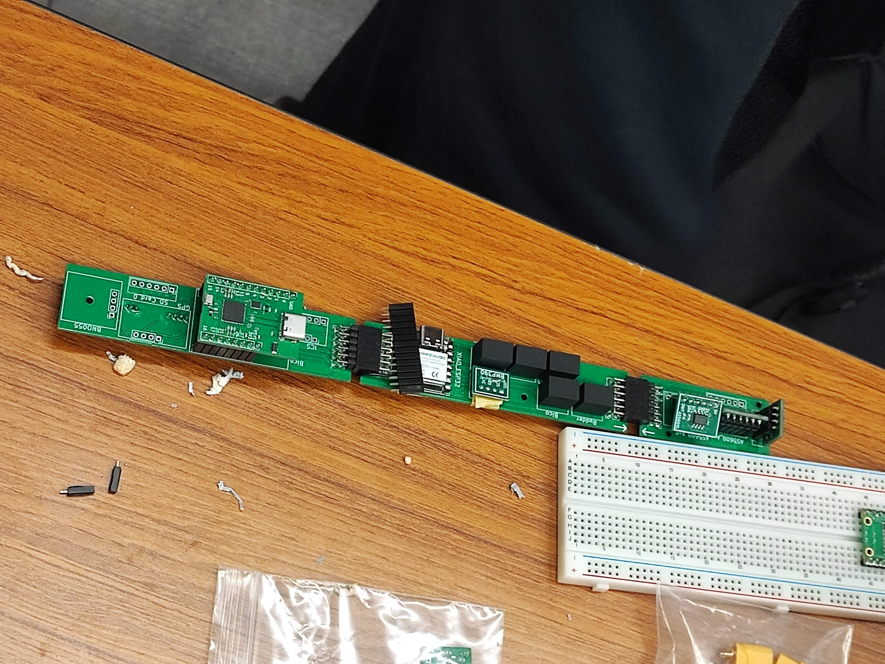
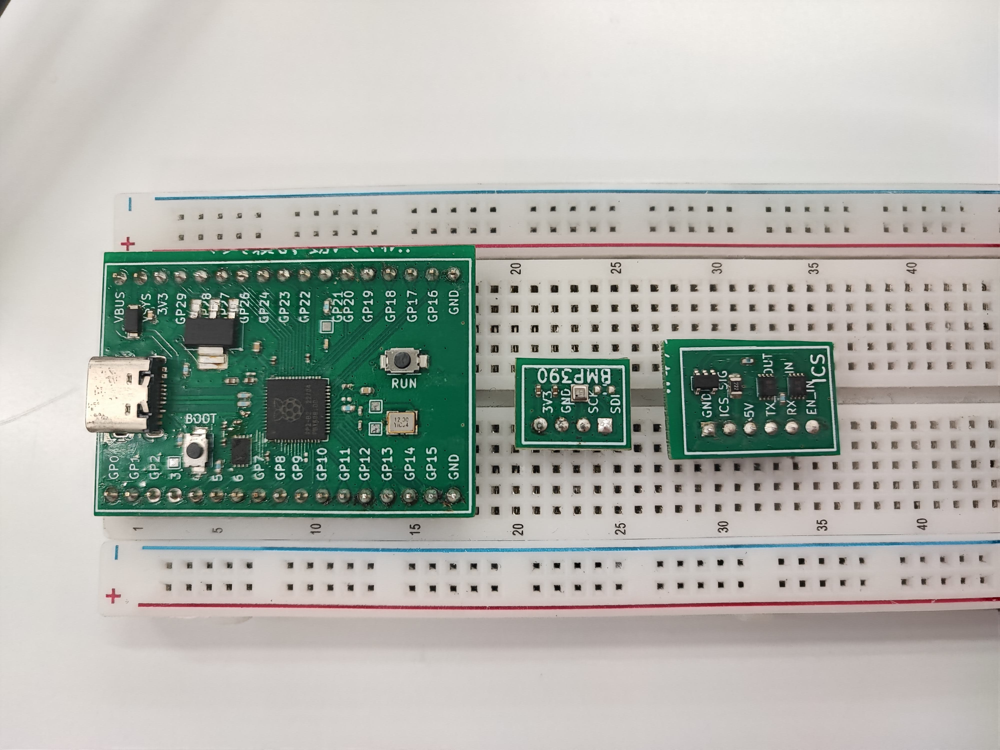

---

 
<h1 align="center">一般教養としての電装</h1>

26代電装班長　<a href="https://git.meganekinoko.com">00kenno</a>

2026/05/22 全体MTG

 

---

 
 
 

---

 
<h1 align="center">この資料の意義✒️</h1>

 電装班はかなりマニアックなため理解者が少ないですが，触れる機会はかなりあります！ 
 ➔ <em><strong>電装への無知がそのままリスクになります</strong></em>⚠️

 

 この資料には，（興味がなくても）<em><strong>一般教養として知ってほしいこと</strong></em> をまとめました．
  
 これを，電装班の「安全講習」に代えさせてもらいます．

 

---

 
 
 

---

<h1>使っている道具 - 1</h1>
<table align="center">
 <tr>
   <td>
     <h2 align="center">はんだごて</h2>
     
⚠️やけどに注意🌡️

     <ul>
       <li>300℃を超える高温🌡️</li>
       <li>なかなか冷めません⚠️</li>
       <li>「はんだ付け」に使います🔧</li>
       <li>プラを溶かさないで🚫</li>
     </ul>
   </td>
   <td></td>
 </tr>
</table>

---

 
 
 

---

<h3 align="center">❓️はんだ付けとは❓️</h3>

 「はんだ」と呼ばれる<em><strong>低い温度で融ける合金</strong></em> で
 金属同士を<em><strong>継ぎ合わせること</strong></em> です．
  
 <em><strong>導電性が良い</strong></em> ので，<em><strong>電子回路の製作</strong></em> に用いられます．
  
 <em><strong>基板に部品を取り付ける</strong></em> ときだけでなく，
 <em><strong>ケーブルの製作</strong></em> でも必要になります．

<table align="center">
 <tr>
  <td></td>
  <td></td>
 </tr>
</table>

---

 
 
 

---

<h3 align="center">⚠️持ち方に注意⚠️</h3>
<table align="center">
  <tr>
    <th align="center">✅️正しい</th>
    <th align="center">❌️間違い</th>
  </tr>
  <tr>
    <td></td>
    <td></td>
  </tr>
</table>

---

 
 
 

---

<h3 align="center">🌡️熱くなる場所🌡️</h3>
<table>
 <tr>
  <td>
   <ul>
    <li>はんだごての<em><strong>金属部分全て</strong></em></li>
    <li>はんだごてを置く<em><strong>こて台</strong></em> (右図)</li>
   </ul>
    
   

    当然見た目には わからないので注意⚠️
   

   

    熱くなっていることを <em><strong>常に疑ってください！</strong></em>
   

  </td>
  <td></td>
 </tr>
</table>

---

 
 
 

---

 
<h3 align="center">⚠️注意事項⚠️</h3>

はんだごての使用に際して，<em><strong>以下のことを忘れないでください！</strong></em>

<ul align="center">
  <li>はんだごてを使っている人の周りをむやみに動き回らない</li>
  <li>はんだごてを使うときは「高温であること」を周知する</li>
</ul>
 

---

 
 
 

---

<h1>使っている道具 - 2</h1>
<table align="center">
 <tr>
   <td>
     <h2 align="center">ホットプレート</h2>
     
⚠️やけどに注意🌡️

     <ul>
       <li>300℃弱の高温🌡️</li>
       <li>なかなか冷めません⚠️</li>
       <li>「表面実装」に使います🔧</li>
       <li>食べ物には使用禁止🚫</li>
     </ul>
   </td>
   <td></td>
 </tr>
</table>

---

 
 
 

---

<h3 align="center">❓️表面実装とは❓️</h3>

 予めクリームはんだを塗った<em><strong>基板自体を加熱し</strong></em>
  
 <em><strong>最小1mm以下の小さな部品</strong></em> を<em><strong>一度に</strong></em> はんだ付けする技術です．

<table align="center">
 <tr>
  <td></td>
  <td></td>
 </tr>
</table>

---

 
 
 

---

 
<h3 align="center">⚠️注意事項⚠️</h3>

ホットプレートの使用に際して，<em><strong>以下のことを忘れないでください！</strong></em>

<ul align="center">
  <li>リフロー作業中に振動を与えない（非常に小さな部品を扱うため）</li>
  <li>ホットプレートを使うときは「高温であること」を周知する</li>
</ul>
 

---

 
 
 

---

<h1>使っている道具 - 3</h1>
<table align="center">
 <tr>
   <td>
     <h2 align="center">ニッパー</h2>
     <ul>
       <li>電線を切断できます✂</li>
     </ul>
   </td>
   <td></td>
   <td></td>
 </tr>
</table>

---

 
 
 

---

<h1>使っている道具 - 4</h1>
<table align="center">
 <tr>
   <td>
     <h2 align="center">ラジオペンチ</h2>
     <ul>
       <li>強く掴むことができます💪</li>
       <li>狭い場所でも使えます✅️</li>
       <li>曲げる，切るなど多機能です✨️</li>
     </ul>
   </td>
   <td></td>
   <td></td>
 </tr>
</table>

---

 
 
 

---

<h1>使っている道具 - 5</h1>
<table align="center">
 <tr>
   <td>
     <h2 align="center">ワイヤーストリッパー</h2>
     <ul>
       <li>電線のビニールを楽に剥がせます✨️</li>
       <li>電線を切ることもできます✂</li>
     </ul>
   </td>
   <td></td>
   <td></td>
 </tr>
</table>

---

 
 
 

---

<h1>使っている部品 - 1</h1>
<h2 align="center">様々なセンサ</h2>

正確なデータが取得できるように，<em><strong>高度なセンサ</strong></em> を使用しています．

<table align="center">
 <tr>
   <td>
     <h3 align="center">ポイント💡</h3>
     <ul>
       <li>高価なものがあります💰️</li>
       <li>壊れやすいです⚠️</li>
       <li>基本的に触れないでください🚫</li>
     </ul>
   </td>
   <td></td>
   <td></td>
 </tr>
</table>

---

 
 
 

---

<h1>使っている部品 - 2</h1>
<h2 align="center">LiPoバッテリー</h2>

 ハイパワーなサーボモーターを駆動するために，<em><strong>高電圧・大電流が供給可能</strong></em> かつ<em><strong>小型・軽量な</strong></em> 
 <em><strong>リチウムポリマー(Li-Po)バッテリー</strong></em> を採用しています．

<table align="center">
 <tr>
   <td>
     <h3 align="center">ポイント💡</h3>
     <ul>
       <li>エネルギー密度が高いです💪</li>
       <li>衝撃に弱いです💥</li>
       <li>ショート(短絡)は厳禁です⚡️</li>
       <li>最悪，発火・炎上します🔥</li>
     </ul>
   </td>
   <td></td>
   <td></td>
 </tr>
</table>

---

 
 
 

---

<h3 align="center">⚠️衝撃に注意⚠️</h3>

<em><strong>
 膨張したバッテリーを使用してはいけません！🚫
  
 発見したらすぐに教えてください！🔔
</strong></em>

<table align="center">
  <tr>
    <th>刺突🔪</th>
    <th>充電中の炎上🔥</th>
  </tr>
  <tr>
    <td></td>
    <td></td>
  </tr>
</table>

---

 
 
 

---

<h1>電装班の製作物について</h1>

 <em><strong>非常にデリケート</strong></em> です⚠️ <em><strong>手の油分で動作しなくなる</strong></em> 可能性もゼロではないです．

<table align="center">
 <tr>
   <td>
     <h2 align="center">ポイント💡</h2>
     <ul>
       <li>製作者以外触れないでください🚫</li>
       <li>基板に触る場合は端を持ってください✅️</li>
       <li>基板上の部品には触らないでください🚫</li>
     </ul>
   </td>
   <td></td>
   <td></td>
 </tr>
</table>

---

 
 
 

---

 
<h1 align="center">最後に✒️</h1>

 この資料を通して，少しでも<em><strong>電装への理解を深めてくれたら，</strong></em>  
 ましてや<em><strong>興味を持ってくれたらHappy</strong></em> です☺️

 
<h2 align="center">
 安全な鳥科ライフを！✈
</h2>
 

---

[Home](https://torica-org.github.io/electronics-blog/)
