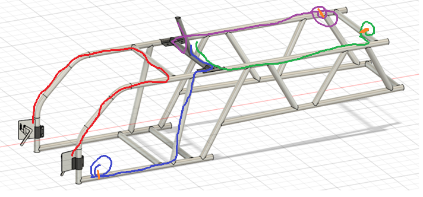
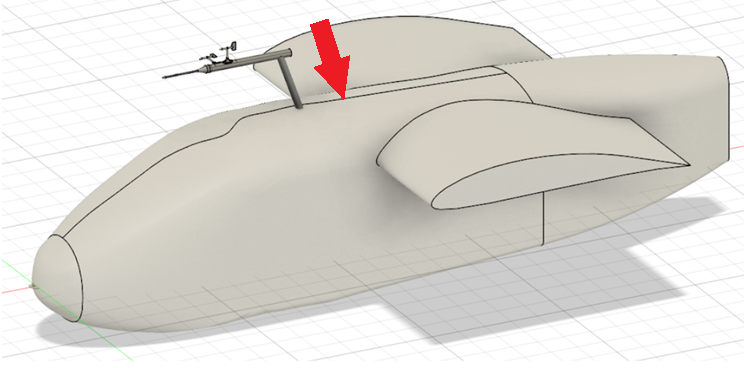

# 2026 REWRITE搭載電装 - 取り扱い説明書

<br>

---

<br>

## ⚠️注意事項⚠️
- 発煙・発火などの異常が見られた場合，速やかに電源を遮断する．
- LiPoバッテリーに膨張などの異常が見られた場合，使用しない．
- サーボモーターが急激に駆動することを周知する声掛けをする．
- ***異常と判断できなくても，気になることがあればすぐに26代の電装班員に報告・確認する．***
    - 異常を見つけてくれたらヒーロー🦸
    - 異常じゃなければ一安心🥰
- カウル，翼，桁など，電装班では***馴染みの少ない製作物に触れるため，十二分に注意する．***

<br>

---

<br>

## 簡単な仕組み（➔詳細は[こちら](https://github.com/torica-org/electronics-docs/tree/main/2026-REWRITE)）

### メインの機能
- フライトログ（フライト中の様々な物理量）の測定・記録をおこなう．
    - センサーのある各電装部からエアデータ電装部に測定した値を送る．
    - エアデータ電装部で各基板のデータを処理，1行の文字列に変換．
    - 生成したログを3箇所（エアデータ，機体下，胴体桁）のmicroSDカードに分散して保存（冗長性の確保）．
- ラダーの駆動
    - ロードセルの値を読み取り，レバーを握り込む力に応じて垂直尾翼を駆動する．

### サブの機能
- ライブラリ[`SerialWeb`](https://github.com/00kenno/SerialWeb)を用いたWi-Fi経由のデバッグログ出力．
- ピッチが水平であるかを示すビープ音をBluetoothで送信し，無線イヤホン経由でテール持ちへ伝達．
- 胴体桁電装部にあるスピーカーにより，機速などの情報をパイロットへ伝達．


<pre class="mermaid" style="background-color:white;width:500px;">
flowchart TD
    subgraph air["エアデータ電装部 (Airdata/Air)"]
        ics(["ICS変換基板"])
        main(["主マイコン"])
        sub(["副マイコン"])
        sensors(["各センサー"])
        
        ics ~~~ main
        sensors -- "機速<br>GPS<br>気温・気圧" --> main
        sensors -- "電圧<br>電流" --> sub
        main -- "ログ保存" --> sub
    end
    rudder["ラダー電装部 (Rudder)"]
    fuselage["胴体桁電装部 (Fuselage)"]
    servo["サーボモーター (Servo)"]
    under["機体下電装部 (Under)"]
    client["スマホなど(Wi-Fi)"]
    bt["無線イヤホン"]
    speaker["スピーカー"]
    tail(("テール持ち"))
    p(("パイロット"))

    under -- "超音波高度<br>LiDAR高度<br>気温・気圧" --> main
    fuselage -- "姿勢角×2<br>気温・気圧" --> main
    rudder -- "駆動角度" --> main
    rudder -- "駆動角度" --> ics -- "サーボ駆動" --> servo
    main -- "ログ保存" ---> under
    main -- "ログ保存" ---> fuselage
    sub -. "デバッグログ" .-> client
    fuselage -.-> bt -- "水平伝達" --> tail
    fuselage --> speaker -- "機速など" --> p
</pre>



<br>

---

<br>

## ケーブルの接続
- 差し込む際は，***奥まで差し込む．***
- 抜く際は，***コネクタを持ち，ケーブルを引っ張らない．***
- PAコネクタの場合は，ロック機構があることに注意する．

```
==================================================================================================
                                         WIRING DIAGRAM
==================================================================================================

          +---------------+                                         +---------------+
          |    Airdata    |                                         | LiPo Battery  |
          +-------+-------+                                         +---------------+
              [PA 12Pin]                                              [XT Connector]
                  |                                                         |
                  |                                                   (Power Cable)
                  |                                                         |
                  |                                                   [XT Connector]
                  |                                                 +---------------+
            (12Pin Cable)                                           |     Power     |
                  |                                                 +-------+-------+
                  |                                                     [PA 4Pin]
                  |                                                         |
                  |                                                 (Air - Power Cable)
                  |                                                         |
              [PA 12Pin]                                                [PA 4Pin]
  +---------------+---------------------------------------------------------+---------------+
  |                                      Terminal                                           |
  +----+--------------------------+-------------------------+----------------------+--------+
  　[PA 4Pin]              　　[PA 4Pin]                [PA 4Pin]               [PA 3Pin]
       |              　　　　　　 |                         |                      |
　(Air - Under)         　　(Air - Rudder)            (Air - Fuselage)        (Air - Servo)
       |                          |                         |                      |
　　[PA 4Pin]                 [PA 4Pin]                 [PA 4Pin]       　　　　[PA 4Pin]
+---------------+         +---------------+         +---------------+       +---------------+
|     Under     |         |  Rudder (R)   |         |   Fuselage    |       |     Servo     |
+---------------+         +-+-----------+-+         +---------------+       +---------------+
                            |       [PA 3Pin]                                [Special 3Pin]
                {Load Cell} ┘           |
                                   (Rudder LR)
                                        |
                                    [PA 3Pin]
                          +-------------+-+
                          |  Rudder (L)   |
                          +-+-------------+
                            |
                {Load Cell} ┘
```

<br>

---

<br>


## アセンブリ - シーケンス図
- 変更される可能性有り．
- 正確に，かつ速やかに動作させられる状態にもっていく．
- 【追記】今年のケーブルは部員が圧着しているため，ケーブルを取り付ける前にコネクタの圧着状態をよく確認すること．


<pre class="mermaid" style="background-color:white;width:500px;">
sequenceDiagram
    participant wing as 翼班
    participant assem as 接合班
    participant cockpit as コクピ班
    participant elec as 電装班

    Note over elec: ラダー取付(*1)
    Note over elec: ベース・下70°接合(*1)
    Note over elec: ケーブル整理(*1)
    Note over elec: Air・LiPo準備
    elec -->> assem:
    Note over assem: T字準備
    assem -->> cockpit:
    Note over cockpit: フレーム接合
    cockpit -->> elec:
    Note over elec: 胴体桁電装部 取付
    elec -->> cockpit:
    Note over cockpit: カウル取付
    cockpit -->> assem:
    Note over assem: テール桁接合
    assem -->> elec:
    alt 同時におこなう
        Note over elec: 内側から12pinケーブル通す
        Note over elec: 上からAirを差込・内側で接合(*2)
        Note over elec: Air12pinケーブル接続
        Note over elec: LiPo接続
        Note over elec: 機体下ケーブル接続
        Note over elec: ラダーケーブル接続
        Note over elec: 胴体桁ケーブル接続
        Note over elec: 外側からサーボケーブル通す
        Note over elec: ターミナル全ケーブル接続
        Note over elec: カーボンドーサルフィン仮固定
    else
        Note over wing,assem: 主翼組み上げ
    end
</pre>


<table>
    <tr>
      <th align="left">(*1)ケーブル接続図</th>
    </tr>
    <tr>
      <td align="left">
        <ul>
          <li>エアデータが刺さる根本がベース・下70°</li>
          <li>ラダーは前についているレバー</li>
          <li>エアデータが刺さる根本にターミナル基板がある（フレームがT字に接合される前にできる限り接続しておく）</li>
        </ul>
        
      </td>
    </tr>
</table>

|図の線の色|種類|
|:--:|:--:|
|赤|ラダーLR接続ケーブル|
|青|Air - 機体下接続ケーブル|
|緑|Air - 胴体桁接続ケーブル|
|紫|Air - サーボ接続ケーブル|

<br>

|(*2)Air接合|
|:--|
||

<br>

---

<br>

## デバッグフローチャート
- フライト当日は，基本的にマイコンに***ソフトウェアを書き込まない***（状況が悪化する可能性があるため）．
- フライト直前では，フライトロガーの動作について***「諦める」***可能性有り．
- 重大なエラーが発生しても，パイロットの安全を重視し***サーボモーターは動作させられるよう最大限努力する．***
- 【追記】今年のケーブルは部員が圧着しているため，***コネクタ周辺をよく確認し，ケーブルの抜けがないかを真っ先に確認すること．***


<pre class="mermaid" style="background-color:white;width:500px;">
flowchart TD
    error(("正常に動作しない"))
    power{"電源が入る？"}
    conn{"ケーブルが断線？"}
    connFix(("ケーブル
    交換／修正"))

    lipo{"バッテリー電圧は
正常？"}
    lipoReplace(("バッテリー交換"))

    poli{"ポリスイッチが
作動した？"}
    cableBreak{"ケーブルが
断線？"}
    cableReplace(("ケーブル
    交換／修正"))

    servo{"サーボは
動作する？"}

    log{"フライトロガー
機能維持？"}

    subgraph theDayBefore["📅前日📅"]
        debugServo1[["デバッグ
（ソフト書換を含む⚡️）"]]
        debugLogger[["デバッグ
（ソフト書換を含む⚡️）"]]
    end

    subgraph thatDay["📅当日📅"]
        debugServo2[["デバッグ
（ソフト書換を含む⚡️）"]]
        noSoft[["デバッグ
（ソフト書換なし❌️）"]]
        morning(["⌛️フライト当日朝⌛️"])
        dock(["⌛️桟橋到達⌛️"])
        dockServo(["⌛️桟橋到達⌛️"])
        giveUp(("デバッグを終了
最低限動作"))
        lock(("ニュートラル
ロック"))
    end

    error --> power
    conn -- "❌️ No ❌️" --> servo
    conn -- "✅️ Yes ✅️" ---> connFix

    power -- "❌️ No ❌️" --> lipo
    lipo -- "✅️ Yes ✅️" ---> poli
    poli -- "✅️ Yes ✅️" ---> cableReplace
    poli -- "❌️ No ❌️" --> cableBreak 
    cableBreak -- "✅️ Yes ✅️" --> cableReplace

    lipo -- "❌️ No ❌️" --> lipoReplace
    
    power -- "✅️ Yes ✅️" --> conn

    servo -- "❌️ No ❌️" --> debugServo1 --> debugServo2 --> dockServo--> lock
    servo -- "✅️ Yes ✅️" ---> log

    log -- "❌️ No ❌️" --> debugLogger --> morning --> noSoft --> dock --> giveUp
</pre>


<br>

---

<br>

## 電源投入／遮断手順
以下の事項が要求される．
- フライトまでに，5分以上の事前運転をする．
  - 9軸センサーは地磁気を利用してヨー角を取得するため，キャリブレーション（センサーの校正）が必要．
  - 自動でおこなわれるが，時間がかかる．
- 垂直尾翼を取り付ける際は，サーボモーターの破損を防ぐためケーブルを抜く．
- 垂直尾翼が取り付けられたまま運用する際は，風により回転するのを防ぐためにサーボモーターにケーブルを接続して駆動させておく．

```
==================================================================================================
                                  電源投入・遮断 操作手順フロー
==================================================================================================

    【 ⚡️ 電源投入手順 ⚡️ 】                     【 ⛔️ 電源遮断手順 ⛔️ 】

        { サーボケーブル抜け確認 }
                    │
                    ▼
        =========================                   =========================
            メインスイッチ ON                           メインスイッチ OFF
        =========================                   =========================
                    │                                           │
                    │ [ 駆動可能な場合 ]                         │ [ サーボ駆動中だった場合 ]
                    ▼                                           ▼
            { 周囲に呼びかけ }                       =========================
                    │                                   サーボケーブル抜く
                    ▼                               =========================
          { 可動範囲の安全と    }
          { 自身の頭の位置を確認 }
                    │
                    ▼
        =========================
           サーボケーブル接続
        =========================
```

<br>

---

<br>
## フライト直前の動き


<pre class="mermaid" style="background-color:white;width:500px;">
sequenceDiagram
    actor aya
    actor mss
    actor atu
    participant wing as 翼周辺
    participant tail as テール周辺

    Note over aya,tail: 桟橋到達
    alt 風速 ~3m/sの場合
        Note over tail: 垂直尾翼接合
        tail -->> mss:
        Note over mss: 電源投入
        mss -->> tail:
        Note over tail: サーボ接続
    else 風速 3m/s~の（または運用上危険な）場合
        Note over mss: 電源投入
    end
    Note over aya,tail: 桟橋運用
    Note over aya,tail: 機体定位置
    Note over aya,tail: 馬入れ
    alt 同時におこなう
        Note over tail: 水平尾翼迎角調整
        opt 未接合
            Note over tail: 垂直尾翼接合
        end
        Note over tail: サーボ接続
        Note over tail: ドーサルフィン取付
    else
        Note over aya: カーボン<br>ドーサルフィン本固定
        Note over mss: 電源スイッチ，ログを確認
        Note over mss: フラグリセット
        Note over mss: スピーカーON
    end
    Note over aya,tail: 全体上げ
    Note over aya,tail: 馬はけ
    Note over wing: 翼持ちA in
    Note over wing: 翼持ちB in
    Note over atu: P保持 in
    tail ->> mss: ニュートラル確認
    mss ->> atu: トリム指示
    Note over atu: トリム調整
    Note over wing,tail: 運用棒抜く
    Note over wing,tail: キャノピー穴埋め
    Note over aya,tail: 位置調整・回転
    Note over atu: P交代
    Note over wing: 翼持ちA交代
    Note over tail: テール持ちセット
    Note over wing: 翼保持はけ
    Note over wing: 翼持ちB out
    Note over aya,tail: 乗り込み
</pre>



<script type="module">
    import mermaid from 'https://cdn.jsdelivr.net/npm/mermaid@11/dist/mermaid.esm.min.mjs';
    let config = { startOnLoad: true, htmlLabels: true };
    mermaid.initialize(config);
</script>



